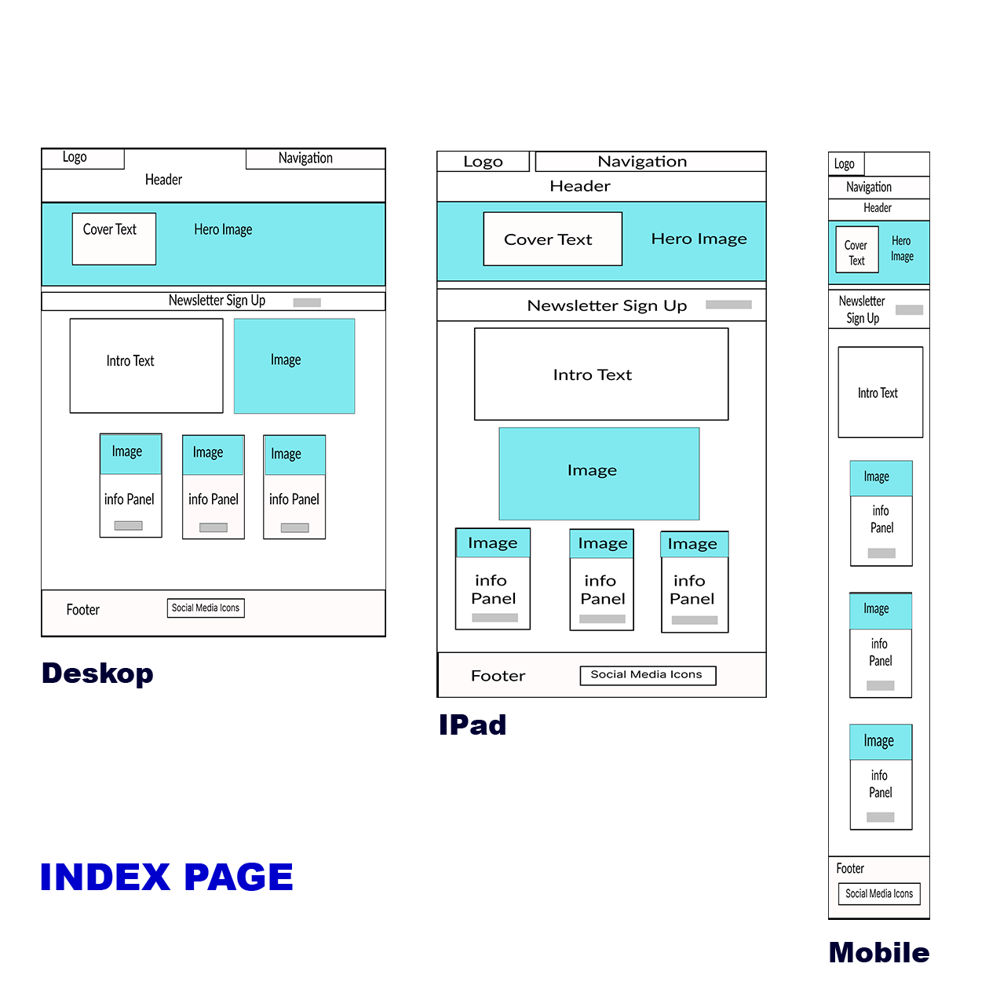

# The Balancing Pact

Tha Balancing pact Website is targeted at the general population from hard working students, people with
busy lifestyles and parents in need of some downtime. It provides information on how you can incorporate
a few simple life changes to improve the quality of your life. It is a concise and practical compendium 
of useful tips and some useful resources to hopefully give inspiration and practical advice for people
seeking out ways to improve their health and wellbeing. People will also be able to sign up for a newsletter and be able to use social media to join a community of like minded people.

  
1. Home Page Wireframe

  

  

  

  

  
   
  

## Gitpod Reminders

To run a frontend (HTML, CSS, Javascript only) application in Gitpod, in the terminal, type:

`python3 -m http.server`

