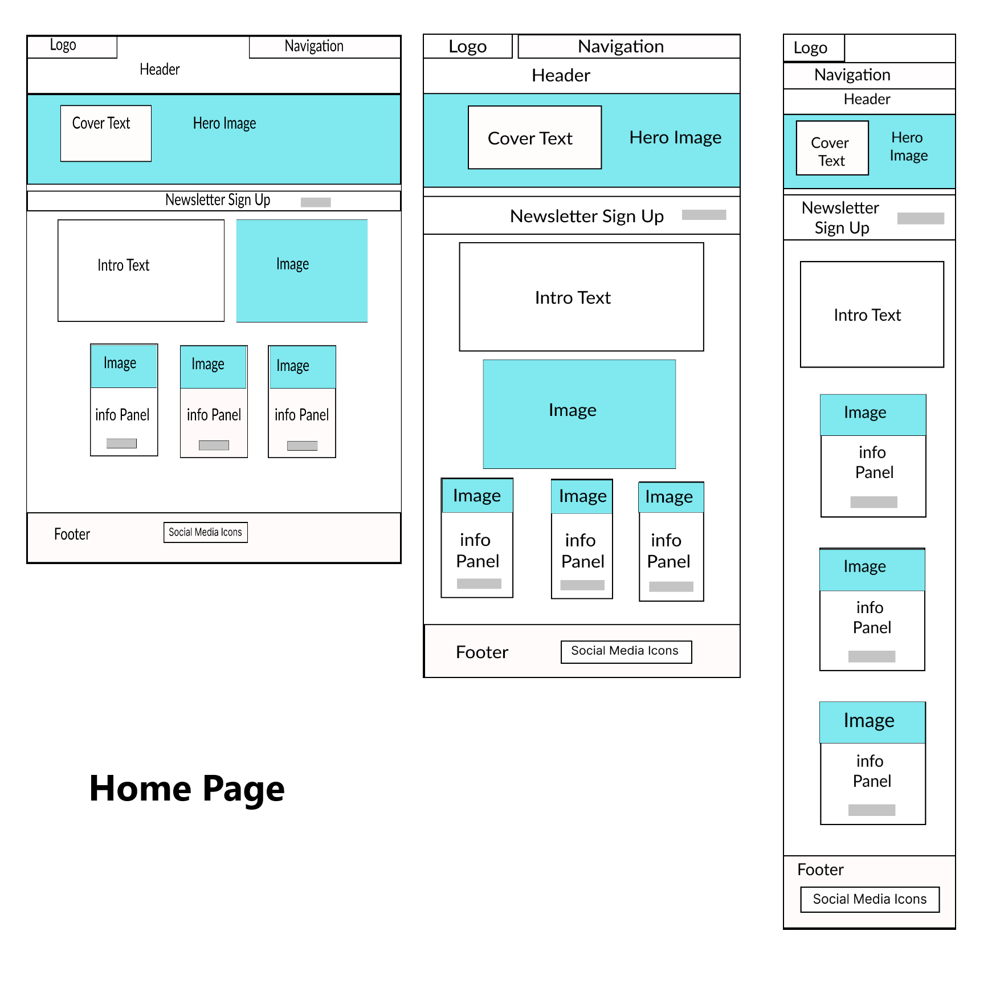
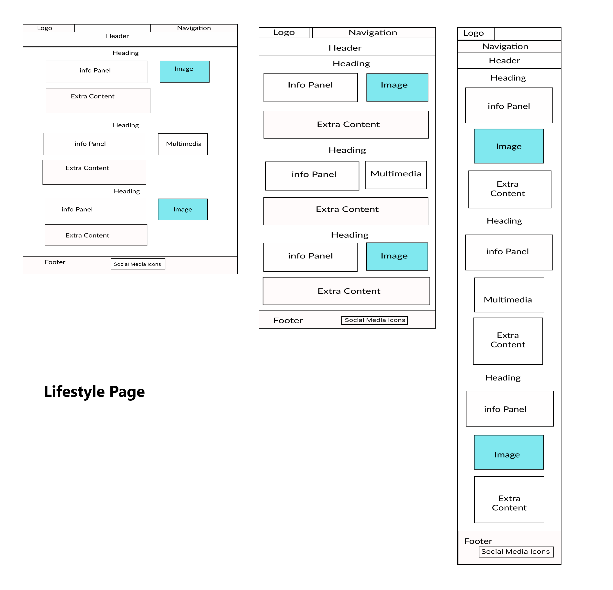
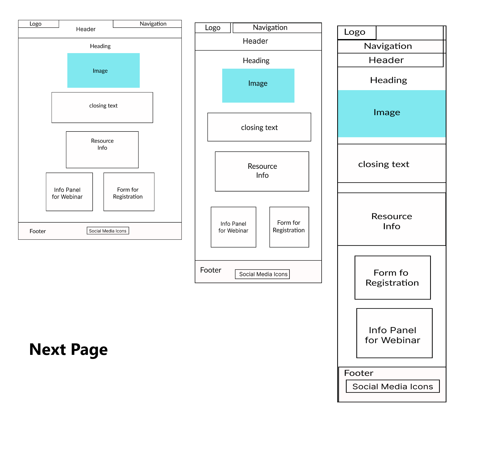
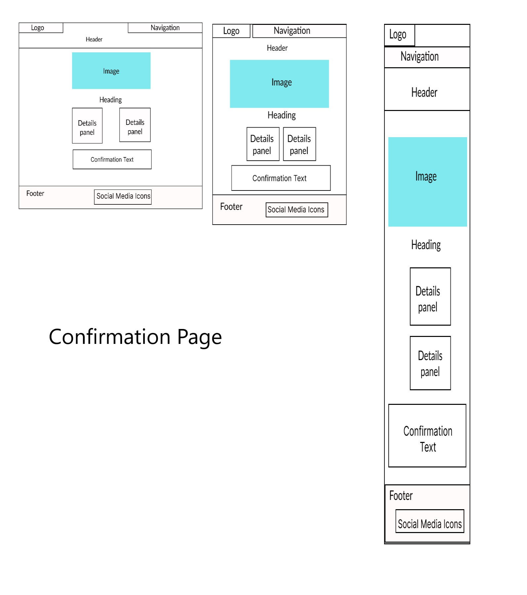
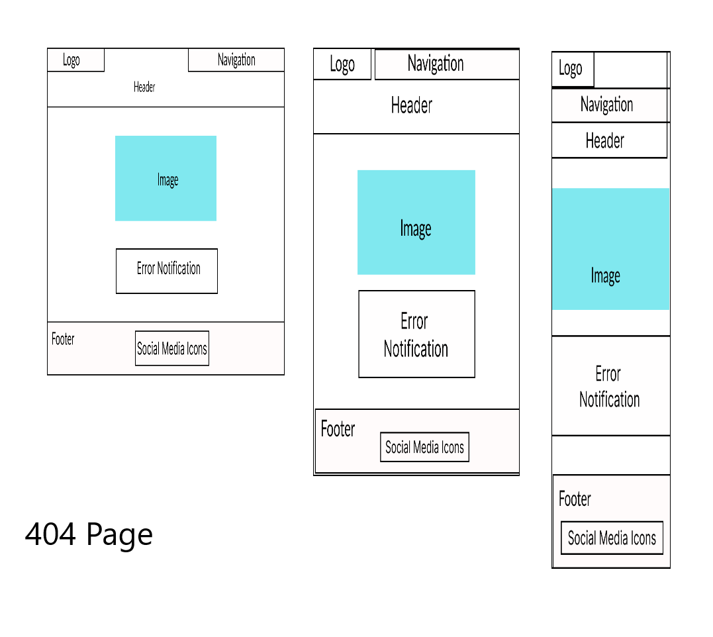

# The Balancing Pact

Tha Balancing pact Website is targeted at the general population from hard working students, people with
busy lifestyles and parents in need of some downtime. It provides information on how you can incorporate
a few simple life changes to improve the quality of your life. It is a concise and practical compendium 
of useful tips and some useful resources to hopefully give inspiration and practical advice for people
seeking out ways to improve their health and wellbeing. People will also be able to sign up for a newsletter and be able to use social media to join a community of like minded people.

# Table of Contents
1. [Introduction](#introduction)
2. [Project Goals](#projectgoals)
    1. [User Goals](#usergoals)
    2. [Site owners Goals](#siteownergoals)
3. [User Experience](#userexperience)
    1. [Target Audience](#targetaudience)
4. [User Stories](#userstories)
    1. [New User](#newuser)
    2. [Site Owner](#siteowner)
5.  [Design](#design)
    1. [Wireframes](#wireframes)
    2. [Colour Scheme](#colourscheme)
    3. [Fonts](#fonts)
    4. [Icons](#icons)
    5. [Structure](#structure)
6.  [Features](#features) 
7.  [Future](#future)
8.  [Tools and Technology](#Technology)
9.  [Testing](#testing)
10. [Bugs](#bugs)
11. [Deployment](#deployment)
12. [Credits](#credits)
13. [Acknowledgements](#acknowledgements)

## This is the introduction 
Some introduction text, formatted in heading 2 style

## Some paragraph 
The first paragraph text

### Sub paragraph 
This is a sub paragraph, formatted in heading 3 style

## Another paragraph 
The second paragraph text

WIREFRAMES FOR SITE

  
1. Home Page Wireframe

  

         

  
2. Lifestyle Page Wireframe

  

  
3. Next Page Wireframe

  

  
4. Confirmation Page Wireframe

  

  
4. 404 Page Wireframe

  

  

  

## Gitpod Reminders

To run a frontend (HTML, CSS, Javascript only) application in Gitpod, in the terminal, type:

`python3 -m http.server`

