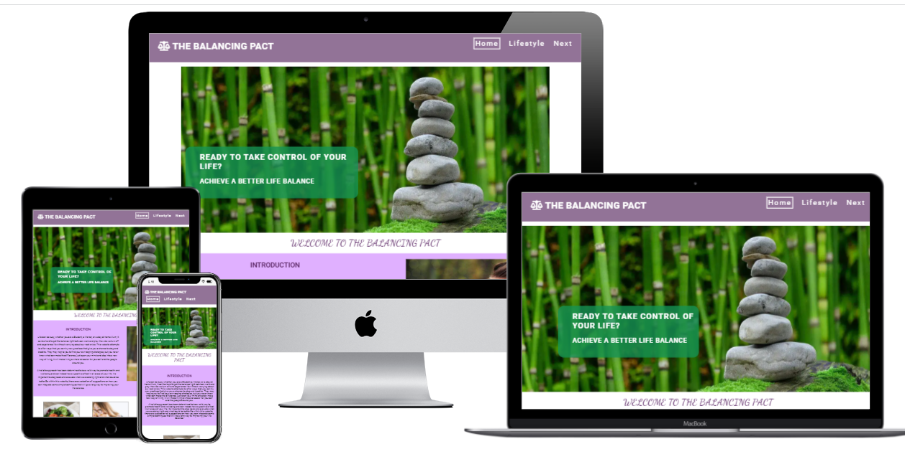

 # The Balancing Pact

[Visit the Balancing Pact](https://mhickey2.github.io/First_Project/)

# Table of Contents 
1. [Introduction](#introduction)
2. [UX Strategy](#uxstrategy)
    1. [Business Goals](#businessgoals)
    2. [Target Customer](#targetcustomer)
3. [User Stories](#userstories)
    1. [First Time User](#firsttimeuser)
    2. [Regular User](#regularuser)
    3. [Site Owner](#siteowner)
4.  [Design](#design)
    1. [Wireframes](#wireframes)
    2. [Colour Scheme](#colourscheme)
    3. [Fonts](#fonts)
    4. [Icons](#icons)
    5. [Structure](#structure)
5.  [Features](#features)
    1. [Home Page](#homepage)
    2. [Lifestyle Page](#lifestylepage)
    3. [Next Page](#nextpage)
    4. [Confirmation Page](#confirmationpage) 
    5. [404 Page](#404page)
6.  [Future](#future)
7.  [Tools and Technology](#Technology)
8.  [Testing](TEST.md)
9.  [Bugs](#bugs)
10. [Deployment](#deployment)
    1. [Repository](#githubrepository)
    2. [Deploy the Site](#deployingsite)
    3. [Run Project locally](#runlocally)
    4. [Student Template](#studenttemplate)
    5. [Custom 404 Page](#404page)
11.  [Credits](#credits)
12.  [Acknowledgements](#acknowledgements)

# The Balancing Pact

      
         

## Introduction 
Tha Balancing pact Website is targeted at the general population from hard working students, people with
busy lifestyles and parents in need of some downtime. It provides information on how you can incorporate
a few simple life changes to improve the quality of your life. It is a concise and practical compendium 
of useful tips and resources to hopefully give inspiration and practical advice for people seeking out 
ways to improve their health and wellbeing. Users will also be able to sign up for an upcoming Webinar 
on the subject and will have the option to use social media to join a community of like minded people.  
 

## UX Strategy 
The website is designed as an introduction to the subject of 'Life Balance', so the aim is to present 
information in a condensed and logical manner within 3 main subject areas. This involved intensive research
initially to find what subject areas are most pertinent and how they can be presented to the users. There was also
a period of competitor analysis on existing websites to evaluate the goals I needed to concentrate on within the project. It was also important to identify the target audience for the website to determine the tone needed in the delivery of the
site.
  

### The Business Goals of the website: 
- no commercial goals, but the site is to build awareness of ways a person can improve their quality of live by adopting simple changes that can integrate into their lives and improve their quality of life.
- Provide simple tips on achieving good work life balance.
- Promote engagement with users by giving them access to a regular newsletter.
- Further engage the user by allowing users to register for an upcoming webinar that offers an interative and more indepth insight into the issues within the site. 
- Offer users the opportunity to engage with others by joining with dedicated social media in order to build a community of people who have the goal to attain more balance in their lives. 
    

### The Target Customer: 
The audience of the site is fairly diverse, but the site would generally be aimed at an adult audience, all genders and age groups. 
Open to single people and those in families, with or without childeren.
Working people, unemployed, Student or retired.
Would probably have some access to digital technology.
People who are seeking some advice or tips on maintaining balance in their lives or can be prone to stress in their lives.  
    

 #### [Return to Table of Contents](#toc)
----
## User Stories
### As a first time user to the site, I want to …..
- i want to learn more about the topics within the site.
- I want to disover the content within the site in relation to my interests.
- I want to learn if there are possible solutions to help me gain more balance in my life.
- I want to find simple changes that I can integrate into my life that will make a difference.
- I want to employ a one stop approach that incorporates a range of options
- I want this information to be concise and easy to find and utilize.
- I want access to resouces that I can access and can help me find more indepth knowledge in specific areas.
- I want to sign up for a newsletter to keep updated on more information on a regular basis.
- I want to utilize social media links to join with like minded people and I can learn and share information with them.  
   

### As a regular user of the site, I want to …...  
- I want to have updated information and possibly more expansion to cover more areas within the remit of the site.
- I would like an updated Resources List. 
- I want more opportunities to be interactive and share my opinions with others. 
  

### As the site owner, I want to …..    
- Provide a compendium of information that offers the user insights and tips to the users on how to create more balance in their life.
- Engage with the site users and discover ways to improve the site and provide information relevant to my user's needs.
- I want to extend the knowledge base within my site and use innovative ways to keep my users satisfied.
- Discover any shortcomings in the present site, and use user feedback to improve the user experience within the site.
     

 #### [Return to Table of Contents](#toc)
----
## Design  
 

Wireframes for Site

Wireframes for Desktop, Medium Screens and Mobile Screens.  
Wireframes were created in Figma. 

  
1. Home Page Wireframe

  

         

  
2. Lifestyle Page Wireframe

   

  

  
3. Next Page Wireframe

   

  

  
4. Confirmation Page Wireframe

   

  

  
4. 404 Page Wireframe

   

  

 

 

## Colour Scheme      

The colour scheme for the website has evolved over time and mainly consists of these complementary colours. There are other colours in the site but they are all a derivation of these colours. 
 

  

 

### Other Colours

- Home Page: 
- The Cover Text on Hero Image: 
- Welcome Panel: Gradient
- Next Page:
- Resources Section background:
- Sign Up Form:

## Fonts used on Site  

### Roboto 
font-family: 'Roboto', sans-serif;    
font-weight: Light 400;  
font-weight: Bold 700;

Used for the majority of the site, both for regular text and headings. Sans serif is the fallback font in case other font is not available. See below for example of font in use.

  

### Dancing Script  
font-family: 'Dancing Script', cursive;  
Font-weight: Regular 400;  
Font-weight: Bold 700;

Used for the opening Welcome Text in the welcome section on the home page and for the Quotes linked to the body, mind and
spirit section on the lifestyle page, and the error message on the 404.page. Cursive is the fallback font in case other font is not available. See below for the font in use.

  

 

## Icons used on site

 

  

- In relation to the Logo I used a 'Balancing Scales icon' to support the overall message of balance in the website. 
- I added the Social Media Icons to the footer element to represent each Social Media Channel. 
- In ther resources section, for logistic reasons I could not add the name of the website in the links themselves so used the arrow icon to indicate what each links relate to as a temporary measure. I also used up arrow in the top of Screen button found at the bottom of each website pages (404 page is short and did not require this feature).        
 
 

## Website Structure     

The website has 4 pages 
- Home Page - Introduces to the subject of Life Balance and introduces the subject areas. It contains links to the Lifestyle Page. 
- Lifestyle Page - Content (Images, Text, Lists and Quotes) is grouped into 3 sections (Body, Mind and Spirit). 
- Next Page - Content broken down into 4 sections (Closing Text and image, Resources and form Section containing details and a registration Form) 
- Confirmation Page - Content (Image and Text and information Panels) displayed to User when they register for the Webinar. User not currently being redirected as the form is sending information to the Code Institute. 
 
There is an additional customised 404 Page - These page is shown when the page required is not available to the user. It consists of an Image and an error message.    

 #### [Return to Table of Contents](#toc)
----
 ## Features  
There are some common featurses available on each page of the website. 

The Logo is positioned at the top left corner and it also acts as a link back to the home page, wherever you are on the site. When a user scans your page, they are naturally drawn to the left hand side and it is a prominent convention in web design to follow this logic. 

The Navigation bar is positioned at the top right of the webpag on Desktop and middle screens, but is responsive and is redeployed where screen size gets smaller. 

 

  

 
Each page also has a footer which contains Social Media links, these open to individual Social Media Pages, but as these are dummie links they are not linked to specific accounts. There is also a copyright address contained within this section.   

 

  

 

#### User Experience related to common elements on each page

### Logo
- The Logo is in the same place on each page.
- The logo can be pressed by the user and they will be returned to the home page.

### Navigation
- There is a navigation bar with clear links to all website pages.
- Navigation tabs are located at the top of the screen which is familiar to the users as it is a common design convention.
- There is an obvious change when the user hovers over the menu items.
- When a menu item has been chosen there is a clear indication that a page has been selected, and the user knows what page they are on.

### Footer
- Social network links are clearly displayed in the footer.  
 

## The Home Page 
 

### Hero Image/Overlay:  
The Home Page's first imapact is the Hero Image at the top of the screen below the header section. This image hopes to capture a delicate balancing act, and is symbolic for the delicate balance we maintain in our lives despite the ongoing effects of a sometimes busy and hectic lifestyle. The colour scheme being green is conducive to health and healing when you research the impact of colour on emotional wellbeing. This image will be rendered smaller on a smaller screen. In combination with the image there is an overly with the key message of the site, and acts as an introduction and an invitation to learn more.   
 

  

 

### Sign Up for Newsletter*: 
This section is displayed early to get the user's attention early. This is the user's opportunity to interact with the site and build a relationship with the site moving forward. This feature has since been removed and will hope to have a better grasp of javascript in order to use a pop up window to find the user details and another pop up to confirm that they have signed up for the newsletter. Image shows how it did look on the screen before the removal.  
 

  

 

### Welcome Section: 
This section builds on from the work in the Hero Image/Overlay, by providing more information to the user, this provides the context for the site, and should give the user enough inofrmation to gauge whether this site has anything to offer them and what they can expect from the site. The text is supplemented by the image, which helps the user relate to the human element behind the website. 
 

  

  

### Breakdown of Information areas: 
The site is boken down into 3 main areas and this section gives a simplified explanation of what they are, what they encompass and there is a call to action ie Body Tips, if they want to go to that area of particular interest i.e Body, Mind and Spirit. There are images to support the textual information.
 

  

    

### The Footer: 
This area shares the Social Media Links with the user, and carries some copyright information for the site.  On a fully developed site it may also include a sitemap, navigation etc. There would also be contact information and a location for the given company/person.
 

  

 

#### User Experience Checklist for Home Page

- The page creates text and images that support the overall theme of the site.
- Images are meaningful and support the text on the page.
- The Hero Image including the cover text conveys the underlying message of the site.
- There is an obvious starting point on the page.
- Home page is clearly recognised as the home page with inclusion of welcoming text below the Hero Image.
- Related information is grouped together under specific headings in the information section below the   welcoming text.
- Clickable items are clearly distinguished.
- The information is concise and there are no large areas of text.
- Content is easily scanable with short paragraphs and there is a clear hierarchy on the page with headings and subheadings indicating what is related to each section.  

## The Lifestyle Page (formerly Technique Page) 

### The Body Section: 
This section contains a text box on the information related to improving your physical health. There is an image supplementing this information and there is a list included that gives simple tips on how you can be proactive in improving your own physical health. In addition there is a body related quote, to support the overall message, this also helps balance the symmetry of the section, as it threw off the general aesthethic of the site. 
 

  

  

### The Mind Section: 
This section contains a text box on the information related to improving your mental health. There is an image supplementing this information and there is a list included that gives simple tips on how you can be proactive in improving your own mental health. In addition there is a mind related quote, to support the overall message, this also helps balance the symmetry of the section.  
 

  

 

### The Spirit Section: 
This section contains a text box on the information related to improving your spiritual health. There is a list included that gives simple tips on how you can be proactive in improving your own spiritual health. There is also an embedded Iframe with a simple 5minute meditation sourced from YouTube, which will allow the user's to try a mediitation for themselves. In addition there is a quote, to support the overall message of the importance of working on the body, mind and spirit to emphasise the importance of combining the elements, this also helps balance the symmetry of the section.
 

  

   

#### User Experience Checklist for Lifestyle Page

## The Next Page 

### What's Next Section: 
The Section includes an image, helping the user relate to the site content and there is a text area, recapping what has been covered so far in the site and highlighting the resources available in the next section and promoting the upcoming webinar which will concentrate on the topics included in the website.
 

  

     

### The Resources Section: 
The Section includes a table with details of websites that will help the user learn more about the subject areas. There is a name, a brief description of the site and links that will bring user directlly to the sites. (will open on to new site in new window, so as to allow the user to keep present site open.  
 

  

   

### The Form Section: 
This section includes a text box explaining the details of the upcoming Webinar, the date, time and location and a Form where the user can register for the Webinar. The post links, use the Code Institute link, as the Webinar is not an actual Event but has been created for educational purposes.
The form itself contains required fields before you can submit the form. There is also a minimul limit on how many characters are needed to complete the name fields. In this case '4 characters' are needed in the name fields.  I would have used placeholders but trusted users would understand what is required.  The email field requires the '@' in order to be a valid entry. There is a placeholder in this field, giving them the format that is required of them. There is also a reset button included to allow user to clear their entries, if they need to restart the process.
I had tried to add javascript event listener to the submit button, but this prooved problematic as it was redirecting the user before all fields were entered and felt it was more advantageous to have the form working correctly, but this again would be an area I would revisit in order to have the Form fully functionally with the redirection in place. I did leave the javascript in place and have comments explaining  the issue. 
 

  

     

#### User Experience Checklist for Next Page

- Related information in grouped together i.e Resources Section, Webinar Section.
- Colour is used to group and structure items on the page i.e Resources and Webinar section.
- There are no broken links.
- Page content is in language the user will understand.  
### Form:
- Only necessary questions are on the form.
- Fields are labelled conventionally.
- Form submission is confirmed by a confirmation page, in this case the Code Institute page showing that the information has been inputted to the site, but in future a confirmation page will be implemented.
- The user is given direction on what is needed to fill in the form correctly I.e required fields, no of characters, inclusion of '@'.
- Email field contains an example to make the expected input clear.
   

  

     

## The Confirmation Page 
This page is displayed when the user registers for the webinar, it confirms to the user that they have their place confirmed in the webinar. It gives them a compact information panel with time and date details with an image showing the date of the Webinar in pictorial form. It also displays a pictorial representation of the Zoom logo, and a message that the link will be delivered to them via email.
There is also a final message to the user on  why it is a good idea to connect with social media as there will be additional information and resources available within these channels. This also acts as a CTA to engage in these channels.  
  

  

  

#### User Experience Checklist for Confirmation Page

- The layout focuses the user's attention on the essential details needed for the webinar I.e. The date and time and the location.
- The images reinforce the details in the information panels. Making use of skeuomorphism by using objects i.e. Zoom Logo and Scheduling Icons, concepts easily recognized by users. 
-The background is uncomplicated so necessary information is easily found.
-The user is informed on what the next steps will be in relation to the webinar.
-There is a clear call to action as the user is encouraged to connect on social media channels to avail of further information and resources.  

## The 404 Page  
This page is displayed to the user if they experience a problem connecting with a desired link. In accordance with the general theme of the site, it conveys a serene image, with an accompanying message in the spirit of relaxation.  I believe the image conveys the spirit of relaxation and although not normally done I left the usual Header and footer elements of the website in place in order for the user to return to the website on whatever page they require. The steps I took to add the 404 page can be found [here](#404). The 404 Page can be found at [https://mhickey2.github.io/First_Project/error.page](https://mhickey2.github.io/First_Project/error.page)
 

  

  

#### User Experience Checklist for 404 Page

- The image is in keeping with the concept of the website.
- All page content (image and message) is useful and appropriate for the situation.  

 #### [Return to Table of Contents](#toc)

----
## Features to be implemented in the Future 
- As mentioned previously, there were a couple of challenges with existing features that I would like to improve in the future. I will utilize javascript to redirect users to the thank you page after they submit their details for the webinar. 
- I will also insert the call to action for the newsletter sign up, and use javascript to create a pop-up form and a notification when they have sucessfully signed up.
- In relation to forms I would also use a captcha/anti-spam feature for security reasons.
- At the moment the navigation on small screens seems adequate, but if I was to add more menu items I would have to implement a hamburger menu.
- I would like to introduce more interactivity in the site by use of a blog, with the latest blog being highlighted within the site and enable users to comment and form threads to promote connections.  

#### [Return to Table of Contents](#toc)
----
## Technologies Used 

- Programming Languages:	HTML,	CSS3
- IDE - Editor:				    Gitpod
- Deployment:			        Gitpod
- Fonts:					        Google Fonts
- Wireframes:             Figma
- Testing                 [https://developer.chrome.com/docs/devtools/](https://developer.chrome.com/docs/devtools/)
- Social Media Icons:		  Font Awesome
- Multimedia:				      Sourced from YouTube
- Free Images:			      Pixalbay, [https://unsplash.com/](https://unsplash.com/), [https://www.pexels.com/](https://www.pexels.com/)
- Image Converter:        Convertio 
- Image Compression:      tinyPNG 

 #### [Return to Table of Contents](#toc)
----
## Deployment  

The Website was developed within Gitpod and was pushed to GitHub using the git commands:
Git add .	Which added all files

Git commit -m “Various Messages”   which commited these files and the message indicated what these files related to i.e “Working on styling for the Navigation”

Git push	Which pushed these files into the GitHub Repository  

### Create a GitHub Repository for your site
1. Use the drop-down menu on the upper far rigt corner of your page and select New Repository.
2. You will be presented with form for input, you can select who owns the repository and can give the repository a name. At this point you can add a description.
3. You can choose the visibility of the site, in this case public was chosen.
4. You can then initialize the site with a README.
5. You can now click the create repository button.  

### To initially deploy this site from the Repository to GitHub pages, the following steps were followed:
1. Log into your GitHub account.
2. Choose the repository that contains your intended site, in this case.
3. Choose the Settings options.
4. Scroll down to the GitHub Pages section. 
5. You will see a Source dropdown Menu you can chose "main", and then "Save", it took a while for the Site to be published, but you will be told when it has been published and will be shown the link to the live site.

### How to fork a GitHub Repository ()
1. Log into GitHub and go to the required Repository.
2. The Fork button is found at the top right corner of the page.
3. When you click this button you will have a copy of the repository in your own GitHub account.

### How to run the project Locally ()
1. You can add a browser extension for gitpod onto your browser, in this case chrome. Also available in Firefox (add-ons). On chrome you use 3 dots on right hand corner of your screen, choose extensions, and again using hamburger menu chose to go to chrome webstore and search for gitpod and your result will be displayed. You will need to authorize permission and it will be added to Chrome.
2. Navigate to your GitHub Repository, there will be a green Gitpod button available now, you can use this and your code will be used to build a workspace which you can use to work locally.
3. The first time you do this, you need to login with GitHub so click to authorize.
4. Within the Code Institute website there is a GitPod button which will allow you to access your workspaces dashboard or you can use a shortcut on your computer to allow you to access these workspaces independently. 

### How to make a local Clone ()
1. Navigate to the main page of the repository.
2. Click the green Code Button at top right of the repository.
3. Copy the url for the repository.
4. Open Git Bash and Change the current working directory to where you want the cloned directory.
5. Type git clone, and then paste the URL you previously copied using $ git clone. 
6. Pressing enter will then create your clone.

### GitHub Student Template ()
This Template has been provided by the Code Institute and includes a number of tools to make life easier and has been used within this present site.  

### Creating a custom 404 page for your GitHub Pages Site ()
1. Navigate to the site repository.
2. Using the 'add file' dropdown, choose 'Create new File'.
3. In the presented filed name, type 404.html/404.md. In my case I chose 404.html.
4. You can then add a meaningful message that describe the changes you made.
5. You can add the commit to current branch or new branch. I chose to commit to main branch and clicked to propose the new file.  

More information is available at [https://docs.github.com/en](https://docs.github.com/en), in regards to GitHub and is a great reference point for all GitHub queries.

 [Return to Table of Contents](#toc)
----
## Testing <a name="TEST.md">

[SEE TESTING on TEST.md Page](TEST.md)

## Bugs 

#### [Return to Table of Contents](#toc)
----
## Credit  

### Content of the site
I created the written content but drew inspiration from this:
[Better up.com Blog](https://www.betterup.com/blog/mind-body-and-soul?fbclid=IwAR3YrY5lJSkBwhZ5ThmwbzLNSRhWmvyO2dHpYe2XXrltwZ-tI8QgQrWUlWo)
I have had an interest in holistic health and stress management in the past and feel Work/Life Balance is a topic highly relevant in the current climate.  
I used the documentation and template provided by the Code Institute to provide the structure of the README file and referred to the GitHub documention as the basis of my Deployment section.

### Media
All the imagery from the site was obtained from: 
Pixalbay Pexels, Unsplash 
The video was sourced from YouTube. 

### Code
The Social Media and Navigation code were based on the code in 'Cool Runnings' project, the previous website on the Code Institute Course.

### Sources
Sites that I have consulted when there was issues with the site: 
- [W3Schools](https://www.w3schools.com/html/html5_svg.asp)
- [https://stackoverflow.com/](https://stackoverflow.com/)
- [https://css-tricks.com/](https://css-tricks.com/)

----
## Acknowledgements 
Thank you to my Mentor 
Thank you to the staff of the Code Institute for their support.

  

