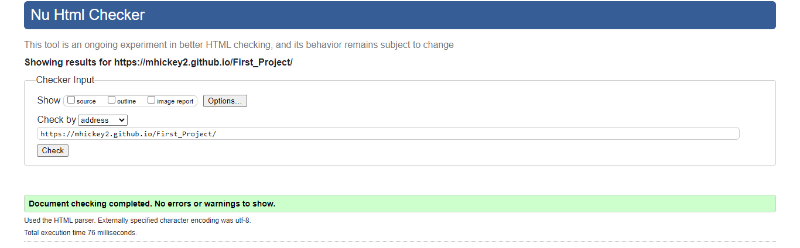
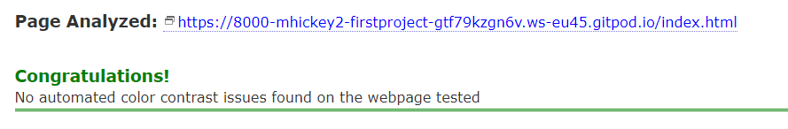
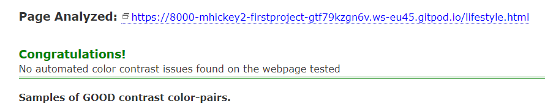
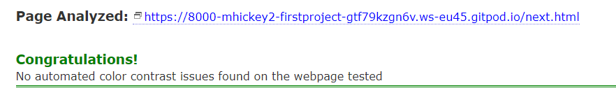
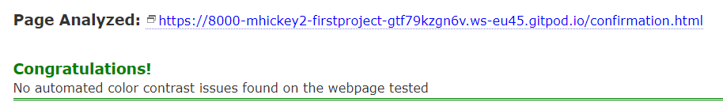
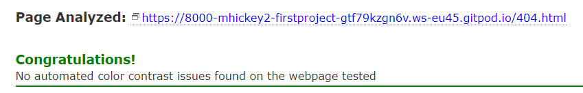
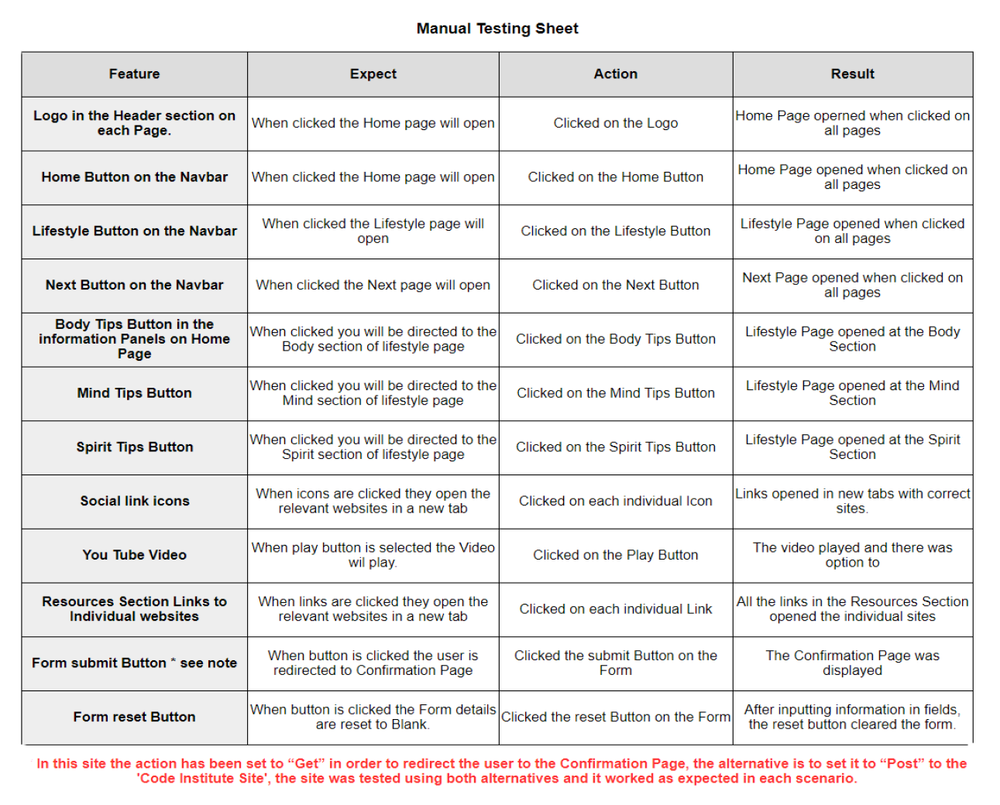

 # The Balancing Pact

# Testing

Browser Testing

  The site was tested in Google Chrome, Microsoft Edge, Mozilla Firefox and Brave Browser on the Desktop.
  The site was tested on iPhone5 on mobile.

  Appearance and Functionality appeared consistent in all browsers

Responsive Testing

   I regularly tested the responsiveness of the site using Google Chrome Developer tools. I also used Window Resizer and a
   Responsive Design Tester Application.

   The Media Query Breakpoints I used where:

Validator Testing

- W3C Validator 

Using [https://validator.w3.org/](https://validator.w3.org/) I tested each page individually and fixed any errors indicated. In the Index page I had used too many arias for features and I removed them. Initially my testing for the 
lifestyle page would not work, so I figured it was the embedded video that was causing the problem so I commented it out
and tested and there were no other problems. The next page had some issues with the links in the resource section but fixed them and there were also some issues with missing tags that highligted one issue that was masking the real one, the body tag had been entered at wrong place and caused rolling issues near bottom of page but fixed that. Other than some headings missing the rest of the site tested without problems. There is some indepth discussion on issues in the bug session.
 

      
        
  

  

  ### Contrast Checker
  Using [https://color.a11y.com/](https://color.a11y.com/) I checked the site for any contrast issues and there were some issues with my introductory text and buttons on my information panels on the index page, so I used the colour contrast checker to test new colours that would not cause any issues, I then made the changes in my css files and tested again, and on revision all the pages passed their tests.

 
  
      
        
  

  
      
        
  

  
      
        
  

  
      
        
  

  
      
        
  

Manual Testing

 

      
     

 
   

User Story Testing

  

## As a first time user to the site

- Learn more about the topics within the site.
- I want to disover the content within the site in relation to my interests.
- I want to learn if there are possible solutions to help me gain more balance in my life.
- I want to find simple changes that I can integrate into my life that will make a difference.
- I want to employ a one stop approach that incorporates a range of options
- I want this information to be concise and easy to find and utilize.
  
Information is delivered in a concise manner, and layed out in logical groupings. Each topic is introduced on the Home Page and are explored more deeply on the lifestyle page. Possible changes are contained in the list items within each section. Each section of the lifestyle page follows the same format to build familiarity with the user and can help the user identify information pertinent to each area of their life in easily absorbed chunks.

There is also a webinar highlighted in the Next page where the user can avail of a free Event that will highlight more information on the subject. 

- I want access to resouces that I can access and can help me find more indepth knowledge in specific areas.
  
The Resources section is available on the Next Page and consists of names of organisations, a brief introduction to what they do and links that will allow the user to research further into their topics of interest.

- I want to sign up for a newsletter to keep updated on more information on a regular basis.
  
This feature has been postponed until the next iteration, when javascript can be applied to allow pop-up form to be enabled.

- I want to utilize social media links to join with like minded people and I can learn and share information with them.

Social Media Links are clearly displayed in the footer section and are promoted further in the Confirmation Page when the user registers for the Webinar.

## As a regular user of the site

- I want to have updated information and possibly more expansion to cover more areas within the remit of the site.
- I would like an updated Resources List.
  
The website can be expanded to include more areas of interest, in this regard expansion will depend on user feedback, this is where intereaction is key and social media and the upcoming webinar will be good resources.

## As the site owner, I want to …..
- Provide a compendium of information that offers the user insights and tips to the users on how to create more balance in their life.
- Engage with the site users and discover ways to improve the site and provide information relevant to my user's needs.
- I want to extend the knowledge base within my site and use innovative ways to keep my users satisfied.
- Discover any shortcomings in the present site, and use user feedback to improve the user experience within the site.

