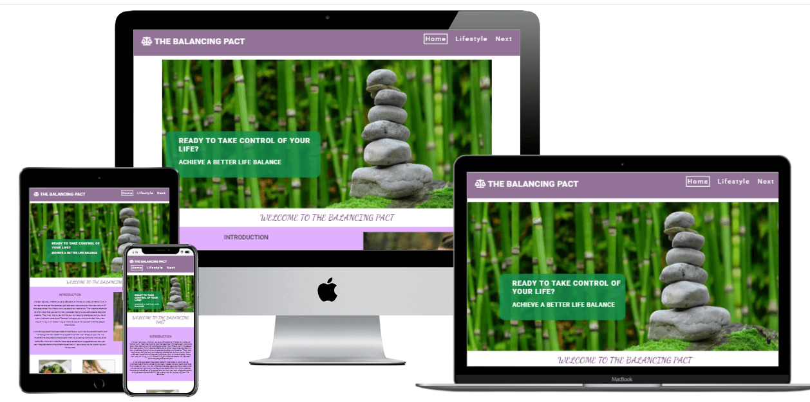
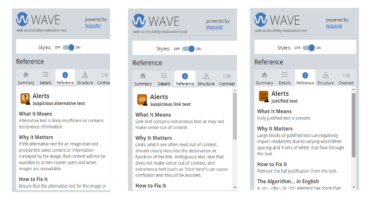

 # The Balancing Pact Testing

# Table of Contents 
1.  [Cross Browser Testing](#browsertesting)
2.  [Responsive Testing](#responsivetesting)
3.  [Validator Testing](#validatortesting)
     1. [W3C Validator](#w3c)
     2. [CSS Validator](#css)
     3. [Lighthouse](#lighthouse)
     4. [Contrast Checker](#contrastchecker)
     5. [WAVE](#wave)
4.  [Manual Testing](#manualtesting)
5. [User Story Testing](#userstorytesting)  

#### [Return to README.md](README.md)
----

## Browser Testing

  The site was tested in Google Chrome, Microsoft Edge, Mozilla Firefox and Brave Browser on the Desktop.
  The site was tested on a Lenovo Laptop, an Acer Aspire Netbook and an iPhone5 on mobile.  

  Appearance and Functionality appeared consistent in all browsers on the Desktop, but on the older iPhone5
  the WebP images could not be seen, on this older model safari does not support these images but in September 2020, WebP support was added in Safari version 14.  
 

----
## Responsive Testing

   I regularly tested the responsiveness of the site using Google Chrome Developer tools, information on this can be found [here](https://developer.chrome.com/docs/devtools/). I also used Window Resizer and a Responsive Design Tester Application available in the Google Chrome Store. The devices I tested for are in the image below.  

    
   
      
          
   

   
   
   I also used [https://ui.dev/amiresponsive](https://ui.dev/amiresponsive) and it was a useful way to see how the site was progressing in regards to reponding to different screen sizes. The image showing responsiveness can be seen below.

    
   
      
        
   

    

   Had not intended to cater for the larger screens but the cover text was problematic on the hero image, so I applied a minor fix. Should be responsive down to 320px screen, but any smaller and there will be issues. In regard to bigger screens it should be good to 5119px. The website is not responsive for the Galaxy Fold, but this is not within my current scope.

   The Media Query Breakpoints I used were:
   - 5120px width and below;
   - 1200px width and below;
   - 950px width and below;
   - 800px width and below;
   - 600px width and below;
   - 400px width and below;

 

----
# Validator Testing

- W3C Validator 

Using [https://validator.w3.org/](https://validator.w3.org/) I tested each page individually and fixed any errors highlighted. In the Index page I had used too many arias for features and I removed them. Initially my testing for the 
lifestyle page would not work, so I figured it was the embedded video that was causing the problem so I commented it out
and tested and there were no other problems. The next page had some issues with the links in the resource section but fixed them and there were also some issues with missing tags that highligted one issue that was masking the real one, the body tag had been entered at wrong place and was causing rolling issues near the bottom of the page but fixed that. Other than some headings missing the rest of the site tested without problems. Ther are more issues in the Bug section in the [README.md](README.md). The results of the HTML validation can be seen below, this was the entire site check, but I did check each individual page at regular intervals.  

 

      
        

   
  
- Jigsaw CSS Validator   

Using [https://jigsaw.w3.org/css-validator/](https://jigsaw.w3.org/css-validator/) I tested the css by inputting the url of the live site, there were 3 errors for obsolete use of floats which I rectified and retested with no issues this time.
I also checked the CSS on the 404.page and it passed successfuly.  
 

      
        

 

- Lighthouse  

Used the Lighthouse Testing in Google Developer Tools and the plan was to share screenshots, but have been having issues getting accurate scores from the site, I did speak with a Turor, with persistant low scores in performance and the Tutor shared screenshots of the pages with me, these were not the scores I was getting and it would not be useful to share my performance scores as they would not be a true representation, it has also made it hard to gauge my progression as I now do not trust the evaluation, this may be due to connection issues or technical issues with my laptop, but is beyond my control. I also tested in Incognito, but was only marginally better.

I have repeated these tests and barring performance scores they are consistently scoring 100, except the mobile screen on the Homepage, where the mobile score is 97, but am working to fix the issue, it regards the buttons in the information section, its proving hard as the button has a regular colour and a hover color, but as the button links to another page, there is no active button state. See image below for Lighthouse scores for all pages in Desktop and Mobile.  
 

      
        

  - Contrast Checker  
  
  Using [https://color.a11y.com/](https://color.a11y.com/) I checked the site for any contrast issues and there were some issues with my introductory text and buttons on my information panels on the index page, so I used the colour contrast checker to test new colours that would not cause any issues, I then made the changes in my css files and tested again, and on revision all the pages passed their tests. See images Below.

 
  
      
        
  

  
      
        
  

  
      
        
  

  
      
        
  

  
      
        
  

   

- Wave (Web Accesability Evaluation tool)   
  
  WAVE is a web accesability tool developed by WebAIM.org. It provides visual feedback about the accessibility of your web content, it highlights any errors and gives you possible suggestions for improvements. After testing it highlighted a couple of issues, including rechecking some of the alt tags, make sure the destination links are evident and advised against justified text as it can be hard on the user's sight. I myself prefer justified text but would rather take the user experience in mind.   
   
  
      
        
  

  

----
## Manual Testing

 

      
     

      
     

 
* In this site the action has been set to “POST” using the 'Code Institute Site' to validate the form action is working correctly and the Code Institute acknowledgment is displaying, I also had used "GET" in order to redirect the user to the Confirmation Page, the site was tested using both alternatives and it worked as expected in each scenario. The 'Confirmation Page' can be found [here](confirmation.html)  
      
 
When working within GitPod, I inserted buttons on the next screen that would take me to page that did not exist so I could test whether the 404 page would be shown. I also had another button that brought me to the confirmation page as I had the form set to 'POST' and not 'GET'. I removed these buttons before final submission. See image below.

 

      
     

 

----

## User Story Testing

  

## As a first time user to the site

- Learn more about the topics within the site.
- I want to disover the content within the site in relation to my interests.
- I want to learn if there are possible solutions to help me gain more balance in my life.
- I want to find simple changes that I can integrate into my life that will make a difference.
- I want to employ a one stop approach that incorporates a range of options
- I want this information to be concise and easy to find and utilize.
  
Information is delivered in a concise manner, and layed out in logical groupings. Each topic is introduced on the Home Page and are explored more deeply on the lifestyle page. Possible changes are contained in the list items within each section. Each section of the lifestyle page follows the same format to build familiarity with the user and can help the user identify information pertinent to each area of their life in easily absorbed chunks.

There is also a webinar highlighted in the Next page where the user can avail of a free Event that will highlight more information on the subject. 

- I want access to resouces that I can access and can help me find more indepth knowledge in specific areas.
  
The Resources section is available on the Next Page and consists of names of organisations, a brief introduction to what they do and links that will allow the user to research further into their topics of interest.

- I want to sign up for a newsletter to keep updated on more information on a regular basis.
  
This feature has been postponed until the next iteration, when javascript can be applied to allow pop-up form to be enabled.

- I want to utilize social media links to join with like minded people and I can learn and share information with them.

Social Media Links are clearly displayed in the footer section and are promoted further in the Confirmation Page when the user registers for the Webinar.  
 

## As a regular user of the site

- I want to have updated information and possibly more expansion to cover more areas within the remit of the site.

After engaging with users, it is hoped that new content will utilize user feedbacks and will be expand according to their needs. The webinar will also be key to determining future scope of the website.

- I would like an updated Resources List.

By keeping up to date with current trends, the resource section will grow to keep up with the futrure needs of the users.   
 

## As the site owner, I want to …..  

- Provide a compendium of information that offers the user insights and tips to create more balance in their lives.
- Engage with the site users and discover ways to improve the site and provide information relevant to my user's needs.
- I want to extend the knowledge base within my site and use innovative ways to keep my users satisfied.

The website can be expanded to include more areas of interest, in this regard expansion will depend on user feedback, this is where intereaction is key and social media and the upcoming webinar will be good resources.

  

#### [Return to Table of Contents](#toc)
#### [Return to README.md](README.md)

----
